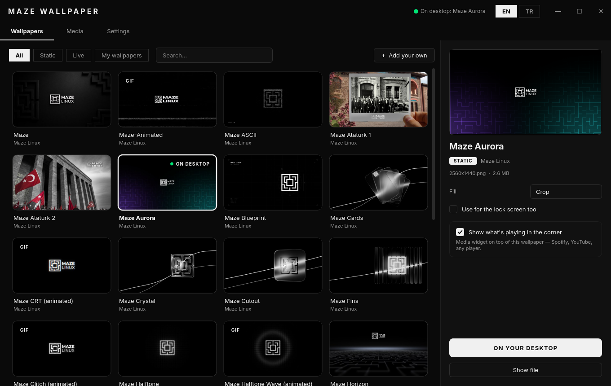
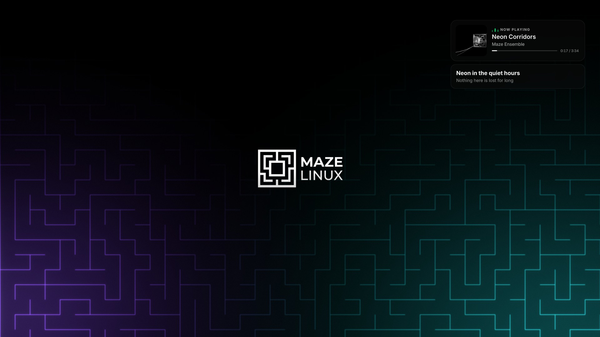
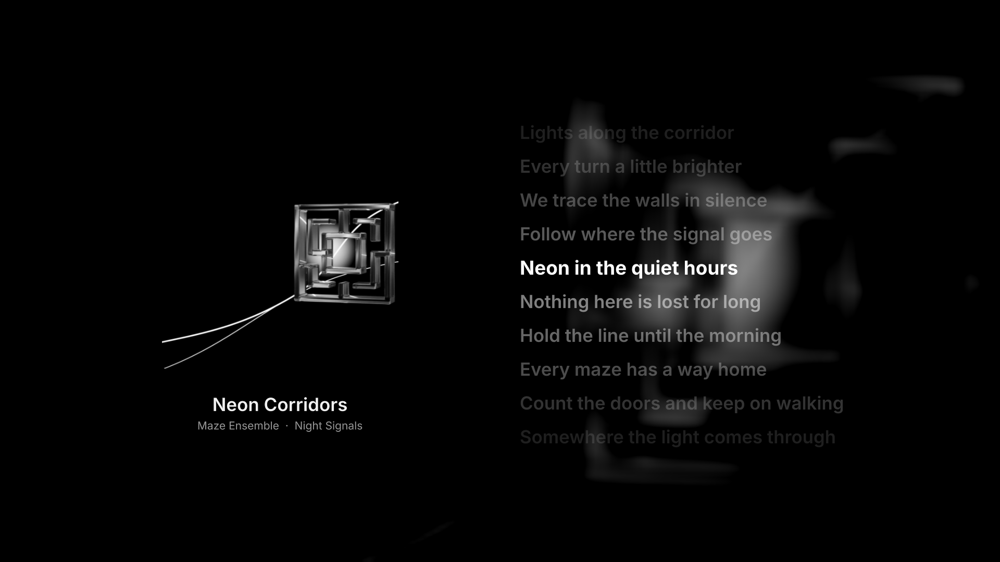
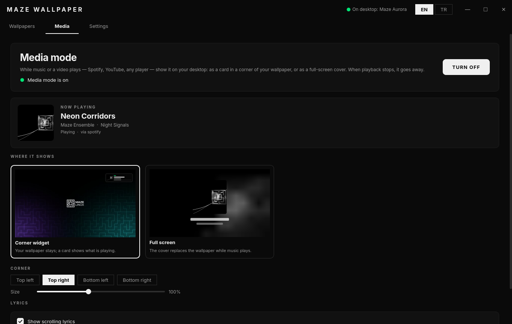
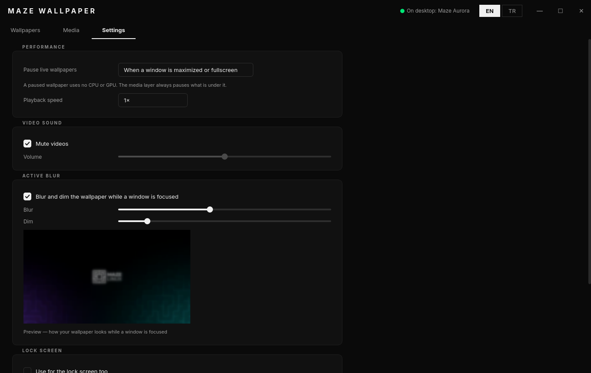

<div align="center">


# MAZE WALLPAPER

**Live wallpapers and media mode for the Maze Linux desktop**

*Static & live wallpapers · Your own videos · Now playing on the desktop · Synced lyrics · Active blur*

*Developed for [Maze Linux](https://github.com/berk-kucuk/MazeLinux)*

---

[](https://python.org)
[](https://pypi.org/project/PyQt6/)
[](https://kde.org/plasma-desktop)
[](https://kernel.org)
[](LICENSE)

</div>

---



---

## What is Maze Wallpaper?

Maze Wallpaper is the Maze Linux desktop's wallpaper. It has two parts:

- **A Plasma wallpaper plugin** (`com.mazelinux.wallpaper`) that draws the desktop. It shows still images, GIFs and looping videos, blurs the desktop when a window has focus, and shows what you are listening to.
- **An app** where you choose a wallpaper, add your own videos and images, and set up media mode.

It ships as the default on Maze Linux: `maze-branding` depends on it, and new users start on it.

<table>
<tr>
<td width="50%"></td>
<td width="50%"></td>
</tr>
<tr>
<td align="center"><sub><b>Corner widget</b>: your wallpaper stays and a card shows what is playing</sub></td>
<td align="center"><sub><b>Full screen</b>: the cover becomes the wallpaper and the lyrics scroll beside it</sub></td>
</tr>
</table>

---

## Features

### Wallpapers
- **Every Maze Linux wallpaper**, both still and animated, read from `maze-branding`. KDE's stock wallpapers are left out of the list.
- **Your own wallpapers:** MP4, WebM, MKV, MOV, GIF, PNG, JPEG, WebP and more. Add them with **+ Add your own**, by dropping files onto the window, or with `maze-wallpaper file.mp4` (Dolphin's *Open with* works too).
- **Your originals are never touched.** Imports are copied into `~/.local/share/maze-wallpaper/library`. Anything you install through Plasma's *Get New Wallpapers* is listed as well.
- **Live preview:** the panel beside the grid plays the actual video or GIF, not a thumbnail.
- Filters for *Static*, *Live* and *My wallpapers*, plus search.

### Media mode
Whatever is playing in Spotify, YouTube, a browser or any other MPRIS player shows up on the desktop.

| Placement | What you get |
|---|---|
| **Corner widget** | A frosted-glass card in the corner of your choice, over your wallpaper. It shows the cover, the track, the artist, bars that move while music plays, and a progress line. The size is adjustable. |
| **Full screen** | The cover replaces the wallpaper while music plays. There are three styles: blurred backdrop, full-bleed cover, or cover on black (OLED). |

- **High-resolution covers.** Browsers pass a small copy of the artwork; YouTube comes through at 336×188. A small helper fetches the full 1280×720 thumbnail from the video id, and Spotify covers at up to 2000×2000.
- **Follows what is actually playing.** A playing player always wins over a paused one, even when the paused one's window has focus.
- **Gets out of the way.** When playback stops the wallpaper comes back. You can also hide it as soon as playback pauses.

### Lyrics (opt-in)
- Time-synced lyrics from [LRCLIB](https://lrclib.net), an open lyrics database.
- **Full screen:** the cover moves to the left and the lyrics scroll beside it. The current line is lit; the rest fade with distance.
- **Corner widget:** the line being sung and the next one appear under the card.
- **Video titles are cleaned up.** "Artist - Song (Official Video) [4K]" becomes "Song" by "Artist" for the lookup. If only unsynced lyrics exist, they advance with the song's progress.

### Active blur
- **Blur on focus:** while a window has focus, the desktop blurs, and so does the media card.
- **Dim without losing the picture:** dimming is a black veil rather than a brightness shift, so Maze's mostly-black wallpapers stay visible instead of collapsing to black.
- **Live preview:** blur and dim strength are set with a preview of your own wallpaper.

### Performance
- **Pauses when hidden:** live wallpapers pause behind maximized or fullscreen windows, or whenever any window has focus (you choose). A paused wallpaper uses no CPU or GPU.
- **Per screen:** each screen pauses on its own. A fullscreen video on one monitor does not stop the wallpaper on the other.
- **Nothing hidden keeps running:** the full-screen cover pauses the wallpaper under it.

### Interface
- Frameless window in the shared Maze visual language, OLED dark and light.
- English and Turkish, switched live from the title bar.
- One click from any wallpaper to *Show what's playing in the corner*.
- The lock screen can use the same wallpaper as a still: the image itself, or a video's first frame.

<table>
<tr>
<td width="50%"></td>
<td width="50%"></td>
</tr>
<tr>
<td align="center"><sub>Media: previews drawn with your wallpaper and the cover that is playing</sub></td>
<td align="center"><sub>Settings: active blur with a live preview</sub></td>
</tr>
</table>

---

## Requirements

- **Desktop:** KDE Plasma 6
- **Python:** 3.11+ with PyQt6 (on Maze Linux, from `maze-python`)
- **Required:** `qt6-multimedia`, `qt6-declarative`, `plasma-workspace`, `kconfig`
- **Optional:** `ffmpeg` (video thumbnails and lock-screen stills), `qt6-multimedia-ffmpeg` (H.264, HEVC, VP9 and AV1 playback)

---

## Installation

### From the Maze repository

**On Maze Linux** it is already installed; `maze-branding` pulls it in. To install it separately:

```bash
sudo pacman -S maze-wallpaper
```

**On Arch Linux and Arch-based distributions**, add the repository once:

1. Import and trust the Maze signing key:

   ```bash
   curl -O https://mazerepo.berkkucukk.com.tr/packages/mazelinux.gpg
   gpg --show-keys --with-fingerprint mazelinux.gpg
   sudo pacman-key --add mazelinux.gpg
   sudo pacman-key --lsign-key 7C4D515A6B930CB04794CEF6147C8159B3E2EE5F
   ```

   The fingerprint `gpg` prints must be `7C4D 515A 6B93 0CB0 4794  CEF6 147C 8159 B3E2 EE5F`.

2. Add the repository to the end of `/etc/pacman.conf`:

   ```ini
   [mazelinux]
   SigLevel = Required DatabaseOptional
   Server = https://mazerepo.berkkucukk.com.tr/packages
   ```

3. Sync and install:

   ```bash
   sudo pacman -Syu maze-wallpaper
   ```

Remove it with `sudo pacman -Rns maze-wallpaper`.

### Build from source

```bash
sudo pacman -S --needed base-devel git
git clone https://github.com/berk-kucuk/maze-wallpaper.git
cd maze-wallpaper
./build-pkg.sh
sudo pacman -U dist-pkg/maze-wallpaper-*-any.pkg.tar.zst
```

The script runs the test suite and `qmllint`, builds the package into `./dist-pkg/`, and stops. It never installs anything and never asks for a password.

`maze-python` (the shared Python runtime) comes from the Maze repository, so add the repository first (steps 1–2 above).

### After installing

Plasma keeps a loaded wallpaper plugin in memory, so restart the shell once after an install or upgrade:

```bash
systemctl --user restart plasma-plasmashell
```

### Running from a source checkout

```bash
./install-plugin.sh      # link the plugin into ~/.local/share/plasma/wallpapers
python3 main.py
```

The link takes precedence over an installed package. Remove it with `./install-plugin.sh --remove` before installing the package.

---

## Architecture

```
┌───────────────────────────────────────────┐   ┌──────────────────────────────┐
│  App  (PyQt6, your user)                  │   │  Media helper (background)   │
│  library · import · previews · settings   │   │  MPRIS ──► high-res covers   │
└──────────────┬────────────────────────────┘   └──────────────┬───────────────┘
               │ org.kde.PlasmaShell.evaluateScript            │ ~/.cache/maze-wallpaper/hires/
               ▼                                               ▼
┌──────────────────────────────────────────────────────────────────────────────┐
│  Plasma wallpaper plugin  com.mazelinux.wallpaper  (QML, inside plasmashell) │
│                                                                              │
│   image / GIF / video ──┐                                                    │
│   corner widget ────────┼──► one blur layer ──► dim veil ──► the desktop     │
│   full-screen cover ────┘          ▲                                         │
│        ▲            ▲              │ TasksModel (this screen's windows)      │
│        │            └── lyrics ◄── lrclib.net (opt-in)                       │
│        └── Plasma's MPRIS model (Spotify, browsers, mpv…)                    │
└──────────────────────────────────────────────────────────────────────────────┘
```

- **The app writes settings and nothing else.** It configures the plugin through Plasma scripting, the same interface `maze-apply-wallpaper` uses. Every desktop it changes is marked with `[MazeLinux] WallpaperApplied=1`, so the login script never resets your choice.
- **The plugin reads MPRIS through Plasma's own model**, the one the media player widget uses, so Spotify needs no setup. It picks the player itself instead of following Plasma's choice, which tracks the focused window.
- **The helper exists because the plugin cannot see page addresses.** Plasma's QML MPRIS model does not expose `xesam:url`. The helper fetches the better image into a cache directory, under a name both sides compute: `md5(artUrl + "\n" + title)`.
- **The lock screen always gets a still** through Plasma's stock Image plugin. A live plugin that failed in the greeter would leave you at a broken lock screen, and the lock screen should not show what you are listening to.

---

## Privacy

Maze Wallpaper makes no network requests unless you turn on a feature that needs one.

| When | Request | Sends |
|---|---|---|
| Media mode is on and a YouTube video plays | `i.ytimg.com` | The video id, to fetch its thumbnail. Firefox has already loaded the same image. |
| Media mode is on and Spotify plays | `i.scdn.co` | The cover id Spotify itself published |
| **Lyrics** is on (off by default) | `lrclib.net` | The artist, title, album and length of what is playing |

There is no account, no analytics, and no telemetry. Media mode reads what is playing locally over D-Bus.

---

## Configuration

The app's own settings are in `~/.config/maze-wallpaper/settings.json`. The plugin's keys live in Plasma's desktop config, where the app writes them. They can also be edited from *Configure Desktop and Wallpaper*.

| Key | Description |
|---|---|
| `Kind` / `Source` | `image` \| `animated` \| `video`, and the file to show |
| `FillMode` | `0` stretch, `1` fit, `2` crop |
| `PauseMode` | `0` never, `1` behind maximized/fullscreen windows, `2` whenever a window has focus |
| `Muted` / `Volume` / `PlaybackRate` | Video sound and speed |
| `ActiveBlur` / `BlurRadius` / `ActiveDim` | Blur on focus, its strength (8–64 px) and the dim veil (%) |
| `MediaMode` | Show what is playing |
| `MediaPlacement` | `0` corner widget, `1` full screen |
| `MediaCorner` / `MediaWidgetSize` | Widget corner (`0` top right, `1` top left, `2` bottom right, `3` bottom left) and size (%) |
| `MediaStyle` | Full screen: `0` blurred backdrop, `1` full-bleed cover, `2` cover on black |
| `MediaShowInfo` / `MediaOnlyPlaying` | Track text under the cover; hide while paused |
| `MediaLyrics` | Lyrics from lrclib.net |

From the command line:

```bash
maze-wallpaper --list                                          # every wallpaper and its id
maze-wallpaper --apply system:/usr/share/wallpapers/Maze-Path  # set one
maze-wallpaper --media on                                      # media mode on/off
```

---

## Debugging

The plugin writes one line to the journal whenever what media mode shows changes. The line includes the player and its state, the placement, which layer is on screen, and the lyrics:

```bash
journalctl --user -o cat | grep maze-wallpaper:
```

```
maze-wallpaper: player=Spotify status=2 art=…b273e395… mode=true placement=0 fullscreen=false/false widget=true/true lyrics=59s
```

---

## Testing

```bash
python3 tests/test_core.py
```

The tests need neither Plasma nor D-Bus. Most cover the places where the app and the plugin must agree:

- every setting must exist in the plugin's `main.xml` and `config.qml`;
- the cache key for high-resolution covers must match the plugin's formula;
- the system wallpaper filter must list only Maze's own packages.

The rest check settings migration, YouTube id parsing, imports that must never leave the library folder, and the two translation tables staying in step. `./build-pkg.sh` also runs `qmllint` on the plugin.

---

## License

Copyright © 2026 Berk Küçük

GPL3. See [LICENSE](LICENSE).

---

<div align="center">
<sub>Part of the Maze suite · Built for KDE Plasma 6 · Tested on Arch Linux</sub>
</div>
